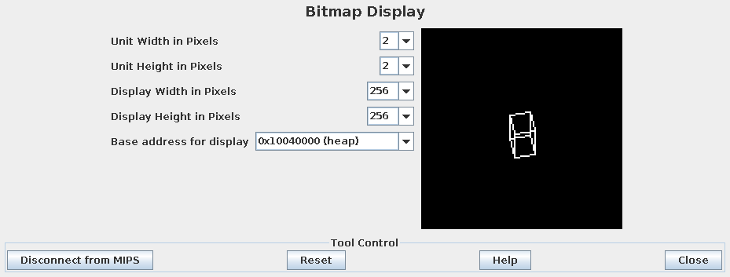

RotatingCube
============

RotatingCube is a project to create an efficient, controllable 3D rotating cube on a MIPS Assembly bitmap display.

The cube includes an implementaion of Bresenham's line algorithm, and some pencil and paper math for each frame of the cube's rotation.

Additionally the makes use of keyboard interrupts so that the q and e key will change the cubes rotation counter-clockwise and clockwise respectively.

